<!-- Please do not change this logo with link -->

<a target="_blank" href="https://www.microchip.com/" id="top-of-page">
   <picture>
      <source media="(prefers-color-scheme: light)" srcset="images/mchp_logo_light.png" width="350">
      <source media="(prefers-color-scheme: dark)" srcset="images/mchp_logo_dark.png" width="350">
      
   </picture>
</a>

# BLDC Reference Design User Guide
This repository contains the firmware and configuration files for the Intelligent BLDC Reference Design, a motor control solution based on the Multi-Phase Power Board (MPPB).

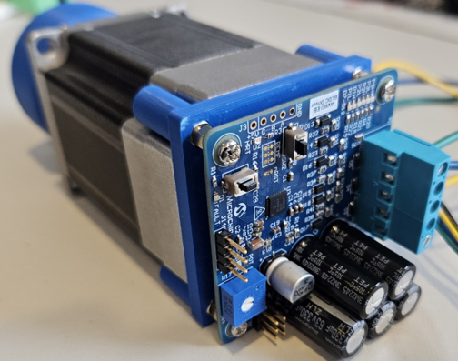

The project demonstrates both:

- Sinusoidal control with Hall-effect sensors
- Trapezoidal sensorless control

It is intended for evaluation, development, and customization using Microchip development tools.

The example firmware was developed using the ACT57BLF02 motor.

## Related Documentation

-[AVR EB Family Page](https://www.microchip.com/en-us/products/microcontrollers-and-microprocessors/8-bit-mcus/avr-mcus/avr-eb?utm_source=GitHub&utm_medium=TextLink&utm_campaign=MCU8_AVR-EB&utm_content=bldc-reference-design-example-github&utm_bu=MCU08)

## Software Used

- [MPLAB® X IDE 6.30.0 or newer](https://www.microchip.com/en-us/tools-resources/develop/mplab-x-ide?utm_source=GitHub&utm_medium=TextLink&utm_campaign=MCU8_AVR-EB&utm_content=bldc-reference-design-example-github&utm_bu=MCU08)
- [MPLAB® XC8 3.1.0 or newer compiler](https://www.microchip.com/en-us/tools-resources/develop/mplab-xc-compilers?utm_source=GitHub&utm_medium=TextLink&utm_campaign=MCU8_AVR-EB&utm_content=bldc-reference-design-example-github&utm_bu=MCU08)
- [MPLAB® Code Configurator (MCC) Device Libraries PIC10 / PIC12 / PIC16 / PIC18 MCUs](https://www.microchip.com/en-us/tools-resources/configure/mplab-code-configurator?utm_source=GitHub&utm_medium=TextLink&utm_campaign=MCU8_AVR-EB&utm_content=bldc-reference-design-example-github&utm_bu=MCU08)
- [AVR-Ex_DFP 2.11.221 or newer pack](https://packs.download.microchip.com/)

## Hardware Used

- [MPLAB® PICKIT 5](https://www.microchip.com/en-us/development-tool/pg164150?utm_source=GitHub&utm_medium=TextLink&utm_campaign=MCU8_AVR-EB&utm_content=bldc-reference-design-example-github&utm_bu=MCU08)
- Intelligent BLDC Reference Design
- ACT57BLF02 BLDC Motor
- 26–48 V Power Supply

## Operation
The Intelligent BLDC Reference Design demonstrates BLDC motor control using the AVR EB family and the AVR MCU Motor Control Library.

Two operating modes are supported:

- **Trapezoidal (Sensorless)** using Back-EMF sensing
- **Sinusoidal (Sensored)** using Hall-effect sensors

The design provides a more compact implementation of the Multi-Phase Power Board by integrating the gate-driver circuitry into the ATA6847 ASSP. The ATA6847 is a dedicated BLDC motor-driver solution that receives control signals from the TCE and WEX peripherals to drive and spin the motor.

---

## Running the Example project

After programming the device:

1. Apply a 26–48 V power supply.
2. Press the User button to start the motor.
3. Adjust the motor speed using the onboard potentiometer.
4. Monitor UART output using MPLAB Data Visualizer.

If a fault occurs:

- The FAULT LED will illuminate
- Diagnostic information can be viewed through the UART interface

> **Note**
>
> The PCB silkscreen contains a labeling error:
>
> - The button labeled **Reset** is connected to a GPIO
> - The button labeled **User SW** is connected to the MCU Reset pin

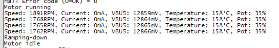

## Project Configuration

### Pin Mapping

| Pin | Function |
|------|-----------------------------|
| PA0 | P1H |
| PA1 | P1L |
| PA2 | P2H |
| PA3 | P2L |
| PA4 | P3H |
| PA5 | P3L |
| PA6 | GPIO |
| PA7 | Analog Input |
| PC0 | Driver Temperature Filter |
| PC1 | UART TX |
| PC2 | UART RX |
| PC3 | Interrupt Request |
| PD0 | Fault Request |
| PD1 | Potentiometer |
| PD2 | GPIO |
| PD3 | Motor Current Filter |
| PD4 | SPI SDO |
| PD5 | SPI SDI |
| PD6 | SPI SCLK |
| PD7 | SPI CS |
| PF0 | User Button |
| PF1 | Configurable Sense |
| PF2 | Configurable Sense |
| PF3 | Configurable Sense |
| PF4 | Virtual Sense |
| PF5 | Heartbeat LED |
| PF6 | Reset Button |
| PF7 | UPDI Programming |

---

## Trapezoidal Control Configuration

The AVR MCU Motor Control Library requires several modifications to support trapezoidal operation on this reference design.

### Configuration Steps

1. Create a new AVR16EB32 project and launch MCC.
2. Disable the clock prescaler for a 20 MHz system clock.

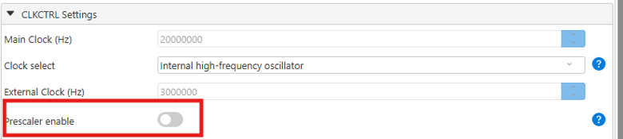

3. Add the following MCC components:

- AVR MCU Motor Control Library
- SPI0
- DELAY

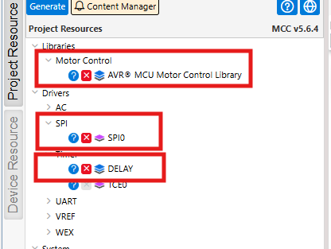

4. Verify the App Builder configuration.

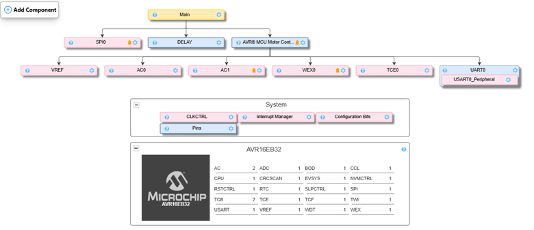

5. Configure the SPI.

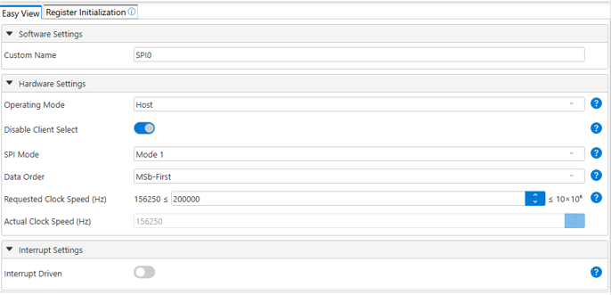

6. Configure the Motor Control Library.

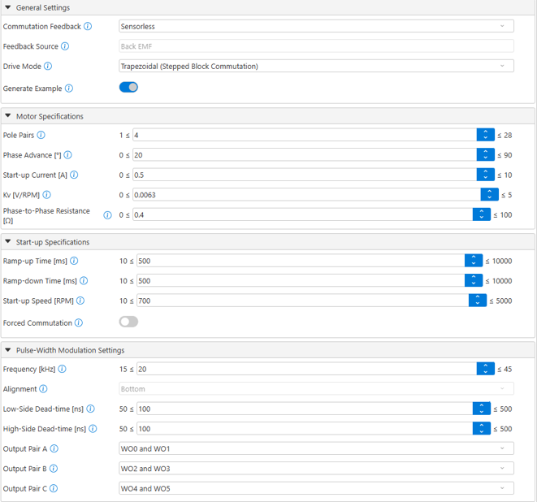

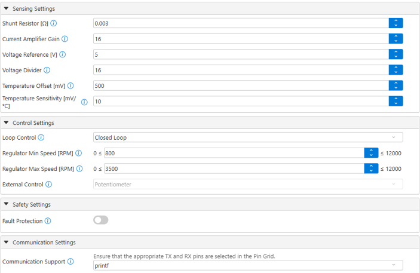

7. Configure the Pin Grid.

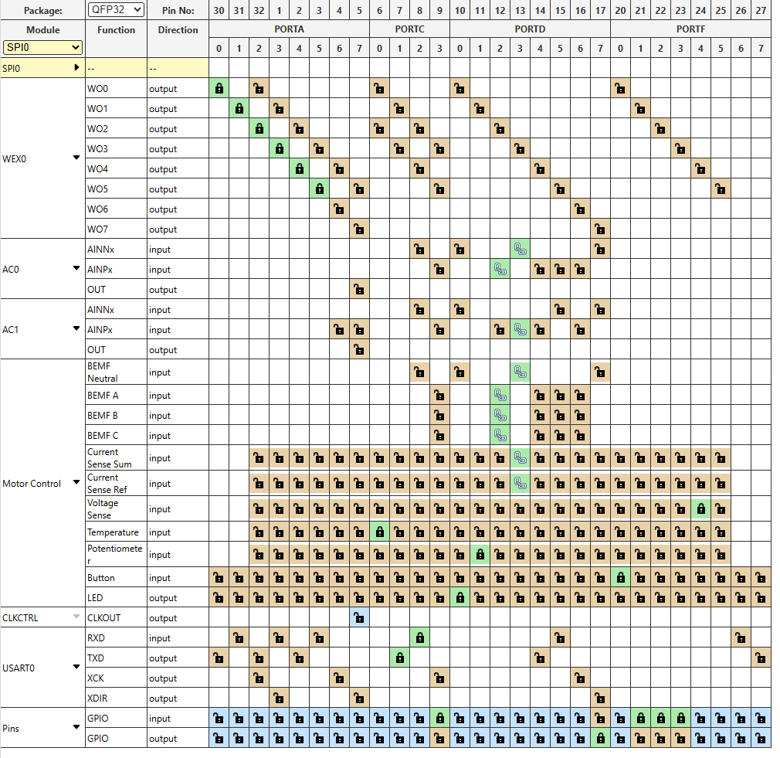

8. Configure all pins.

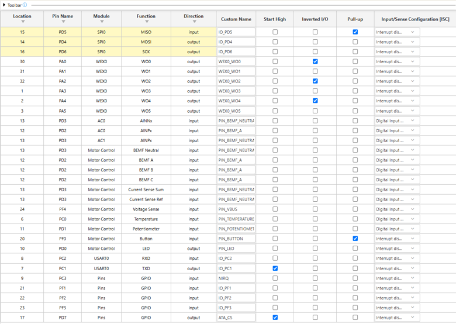

9. Generate the code.

10. Modify **mc_pins.h** by changing the ADC reference to GND.

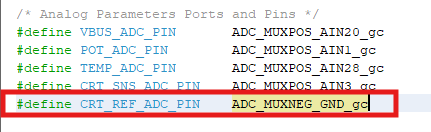

11. Add two new functions to **mc_sensing.h**.

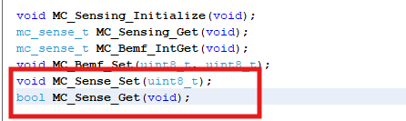

12. Update **mc_sensing.c** by implementing the new functions and modifying the existing sensing routines.

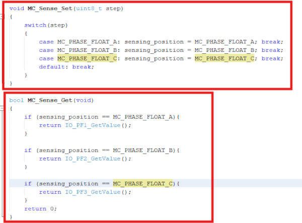

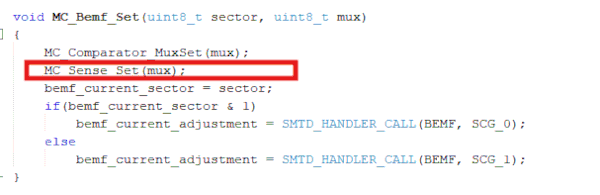

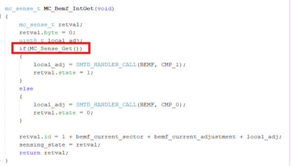

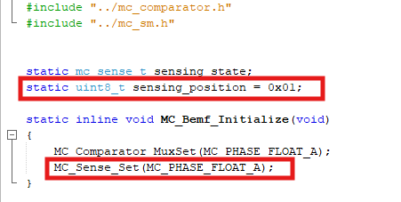

These modifications only change the source of the commutation feedback and do not affect the library state machine.

13. Add the ATA programming sequence to **main.c**.

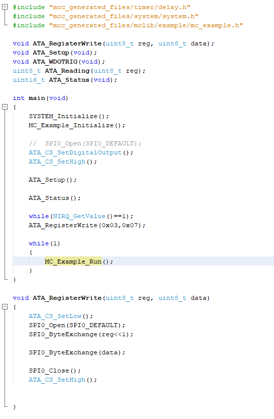

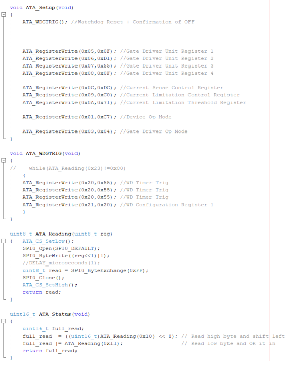

14. Clean, rebuild, and program the device.

---
## Hardware Changes (Sinusoidal Drive)

To make sinusoidal drive to work, a few hardware changes must be made to the board. There is a set of sense jumpers that must be disconnected, as shown in the following figure under the BEMF. Instead, connect the hall effect sensors to the provided through-hole connections.

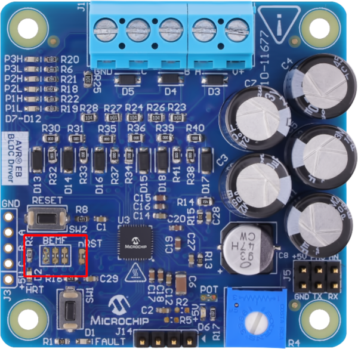 
 
After these connections are severed, follow steps 1-4 as in the trapezoidal setup.

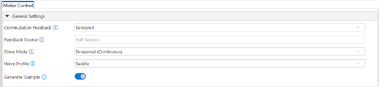 

In the motor control library, the only changes needed are to the commutation feedback, and drive mode. The wave profile can change depending on the application. There are no changes needed to be made within the `mc_pins`, and `mc_sensing` files.

## Application Source Code

This example uses the example code used in the AVR EB Motor Control Library. Code is added to interact with the ATA6847 ASSP, which sends the signals from the EB to the the motor. The only change is to the `main.c` file.

## Conclusion
The Intelligent BLDC Reference Design provides a compact BLDC motor control platform based on the AVR EB family and the multiphase board. By supporting both trapezoidal and sinusoidal control methods, the design offers flexibility for evaluating different motor control techniques while leveraging the AVR MCU Motor Control Library.

---

## Related Projects

-[Stepper Board Reference Design](https://mplab-discover.microchip.com/v2/item/com.microchip.code.examples/com.microchip.ide.project/com.microchip.subcategories.modules-and-peripherals.analog.cmp/com.microchip.mcu8.mplabx.project.avr16eb32-stepper-drive-mplab-mcc/1.0.0?view=about&dsl=AVR+AND+EB+AND+Motor)

-[AVR EB Motor Control Library User Guide](https://mplab-discover.microchip.com/v2/item/com.microchip.code.examples/com.microchip.ide.project/com.microchip.subcategories.modules-and-peripherals.timing-counting-and-signal-generation.ic/com.microchip.mcu8.mplabx.project.avr16eb32-bipolar-stepper-motor-drive/1.0.1?view=about&dsl=AVR+AND+EB+AND+Motor)F